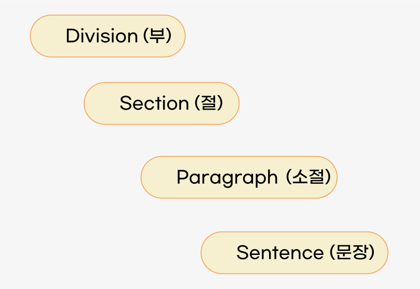

### Fortran
- **최초**의 고급 언어
- **효율성**( = 빠른 실행)
- 정적(static) 메모리

### Cobol
- **비즈니스** 업무처리용 고급언어
 (Common Business-Oriented Language)
- **낮은 가독성**
- **Record** 도입
- 선언부(declaration) + 도입부(execution)

### Algol
- **mothor 모태** 언어
- 범용 언어
- 블록 구조
- 매개변수/ 파라미터/ 인자 전달

### Pascal
- 프로그래밍 교육용
- 블록 구조
- 단순(simple)

### C
- 장점
    - 단순 간결 
    - 효율적(= 빠른 실행)
    - 포인터 데이터 유형
- 단점
    - 낮은 가독성
    - 약한 타입 검사
    - 데이터 캡슐화 지원 안함

### C++
- 객체지향 언어
- 캡슐화 지원

### C#
- .NET env
- 객체지향 언어
- 컴포넌트 기반 프로그래밍
- 특징
    - **강한 타입 검사**(type checking)
    - 배열 경계 검사(array bound checking)
    - 초기화하지 않은 변수 탐지
자동 쓰레기 수집
    - 국제화:unicode
    - apps for host, embedded systems (하드웨어 호환성)

### Java
- 하드/소프트 **플랫폼에 독립**
- C++ 보다 단순
- 분산 환경 지원
- 객체지향 언어
- application, applet 사용

### Perl
- CGI(Common Gate Interface) 프로그램 개발 사용
- 텍스트 파일 처리 강점
- 인터프리터 언어
- 변수
    - 스칼라 형(scalar type): $
    - 배열형(array or vector type): @
- 특징
    - 변수 **선언 안함**
    - 배열 크기를 미리 선언
    - 디폴트 초기값 제공

### Lisp
- List processor
- Alprogramming
- 자동 기억장소 관리
- 동적 바인딩

### .etc

- SNOBOL - 다양한 패턴 매칭 기능 제공
- BASIC - 프로그래밍 교육용
PL/I : 모든 언어의 장점만 모은 것
- Ada US D.O.D - 패키지 예외 처리 랑데뷰 등
- Python
- Kotlin
- Swift
- Go
- Dart

## 질문

- 옛날 언어의 유용성을 아직 잘 모르겠네요 어떤 코드가 쓰였는지 알 수 있을까요?